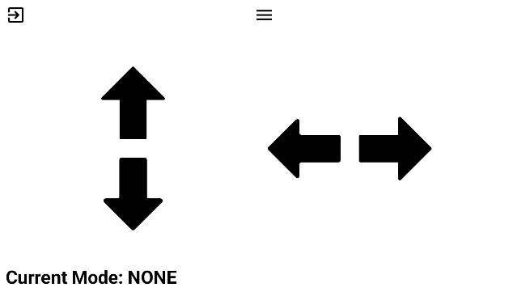
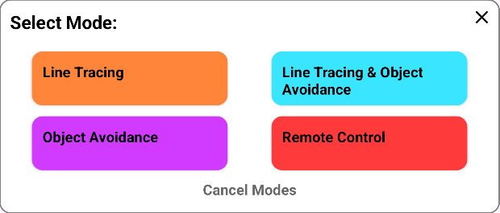

# Arduino Controller 
An arduino controller that can choose between multiple modes. This controller is used specifically for our Arduino design and code. It's meant to be a controller for our Arduino Smart Car.

## Project Description
This project is made with the purpose of controlling the smart car made with Arduino. The smart car has 4 function that can be chosen from with the application. The four functions include Line Tracing, Object Avoidance, Both Line Tracing and Object Avoidance, and Remote Control Mode. The main function of this application is to control the robot with simple user interface and choose between modes the robot can perform. The project in compiled using Android Studio and will be used in conjunction with Arduino IDE Serial to exchange data. The display UI is as follows:




## How to Install or Use the Project
### To use this project you need to install the following:
- Android Studio
- Arduino IDE

You need to load the project folder in Android Studio to use it, or alternatively just download the APK in the `app/build/release/app_release.apk`.

### In Arduino IDE, you need to create a program that takes get data from the app and perform tasks based on those results.
- **UP Arrow** sends a 'W' char byte when pushed down and 'w' char byte when released.
- **DOWN Arrow** sends a 'S' char byte when pushed down and 's' char byte when released.
- **LEFT Arrow** sends a 'A' char byte when pushed down and 'a' char byte when released.
- **RIGHT Arrow** sends a 'D' char byte when pushed down and 'd' char byte when released.
- **LINE TRACING Button** sends a 'L' char byte.
- **OBJECT AVOIDANCE  Button** sends a 'O' char byte.
- **LINE TRACING AND OBJECT AVOIDANCE Button** sends a 'B' char byte.
- **REMOTE CONTROL Button** sends a 'R' char byte.
- **NO MODE Button** sends a 'N' char byte.

### Using these char bytes in the bitstream, you can code the program to perform specific tasks depending on what char byte is received by the Arduino Serial. 

The example is below, however if you would like a full working code you may proceed to the end of this file to look at it.

```
if(Serial.available() > 0){
    char moveCommand = Serial.read();
}

  if(moveCommand == 'W'){
    //Move Forward
  }
  else if(moveCommand == 'w'){
    //Stop
  }

  if(moveCommand == 'S'){
    //Move Backward
  }
  else if(moveCommand == 's'){
    //Stop
  }

  if(moveCommand == 'A'){
    //Move Left
  }
  else if(moveCommand == 'a'){
    //Stop
  }

  if(moveCommand == 'D'){
    //Move Right
  }
  else if(moveCommand == 'd'){
    //Stop
  }
```

### Next is to build the actual smart car robot. The following are the components and the wiring diagram.
- Arduino UNO
- L293D Motor Shield
- 4 DC Motors
- 4 Wheels
- HC-05 Bluetooth Module
- 2 IR Sensors
- Servo Motor
- Ultrasonic Sensor
- 2 or 3 18650 Battery

## Example Code

Here is the fully working code of the Arduino. If you have used other types of Motor Shield Drivers, make sure to revise the code accordingly. Make sure to also download and install the Adafruit Motor Shield Library at their [Official Website](https://github.com/adafruit/Adafruit-Motor-Shield-library).

```
#include <AFMotor.h>
#include <SoftwareSerial.h>
#include <Servo.h>

Servo servo;

//Pin Numbers
int trigPin = A0;
int echoPin = A1;
int leftSensorPin = A2;
int rightSensorPin = A3;
int servoPin = A4;
int rxPin = 9;
int txPin = 10;

//Bluetooth Serial
SoftwareSerial remoteControl(rxPin, txPin);

//Remote Control Variables
bool movingForward = false;
bool movingBackward = false;
bool movingLeft = false;
bool movingRight = false;
bool hasInput = false;
char command = 'N';

//Mode Variables
enum Mode { NONE, LINETRACE, OBJAVOID, BOTH, REMOTECONTROL };
Mode currentMode = NONE;

//Motor Variables
int motorSpeed;
double stopDistance = 35;
double obstacleDistance = 17;
enum Path { NOPATH, LEFT, RIGHT };
Path avoidancePath = NOPATH;

//Motor Assignment
AF_DCMotor leftF(4); //Left-Front WHeel
AF_DCMotor leftB(1); //Left-Back Wheel
AF_DCMotor rightF(3); //Right-Front Wheel
AF_DCMotor rightB(2); //Right-Back WHeel

void setup() {
  pinMode(trigPin, OUTPUT);
  pinMode(echoPin, INPUT);
  pinMode(leftSensorPin, INPUT);
  pinMode(rightSensorPin, INPUT);
  servo.attach(servoPin);

  remoteControl.begin(9600);

  servo.write(90);

  stopMovement();

}

void loop() {
  if(remoteControl.available() > 0){
    command = remoteControl.read();
    hasInput = true;
    selectMode(command);
  }
  else {
    hasInput = false;
  }

  if(currentMode == LINETRACE){
    double distance = getDistance();

    if(distance > stopDistance){
      int sensorLState = digitalRead(leftSensorPin);
      int sensorRState = digitalRead(rightSensorPin);

      if(sensorLState == LOW && sensorRState == LOW){
        motorSpeed = 45;
        moveForward();
      }
      else if(sensorLState == HIGH && sensorRState == LOW){
        motorSpeed = 150;
        turnLeft();
      }
      else if(sensorLState == LOW && sensorRState == HIGH){
        motorSpeed = 150;
        turnRight();
      }
      else{
        stopMovement();
      }
    }else {
      stopMovement();
    }
    delay(50);
  }
  else if(currentMode == OBJAVOID){
    motorSpeed = 120;
    double distance = getDistance();

    if(distance > stopDistance){
      moveForward();
    }
    else{
      moveBackward();
      delay(100);
      stopMovement();
      delay(100);
      checkDirection();
    }
     delay(50);
  }
  else if(currentMode == BOTH){
    double distance = getDistance();
    int sensorLState = digitalRead(leftSensorPin);
    int sensorRState = digitalRead(rightSensorPin);

    if(distance > obstacleDistance){
      if(sensorLState == HIGH && sensorRState == LOW){
        motorSpeed = 150;
        turnLeft();
      }
      else if(sensorLState == LOW && sensorRState == HIGH){
        motorSpeed = 150;
        turnRight();
      }
      else if(sensorLState == LOW && sensorRState == LOW) {
        motorSpeed = 45;
        moveForward();
      }
      else {
        stopMovement();
      }
    }
    else {
      stopMovement();
      delay(100);
      checkDirection();
      delay(200);

      if(avoidancePath == RIGHT){
        goAroundRight();
      }
      else if(avoidancePath == LEFT){
        goAroundLeft();
      }
    }
    delay(50);
  }
  else if(currentMode == REMOTECONTROL){
    motorSpeed = 150;
    if(hasInput){
      char moveCommand = command;

      checkCommand(moveCommand);

      if(movingRight){
        turnRight();
      }
      else if(movingLeft){
        turnLeft();
      }
      else if(movingForward){
        moveForward();
      }
      else if(movingBackward){
        moveBackward();
      }
      else{
        stopMovement();
      }

      delay(50);
    }
  }
  else {
    servo.write(90);
    stopMovement();
  }
}

double getDistance(){
  double distance;
  double time;
  double speed = 0.0344;

  digitalWrite(trigPin, HIGH);
  delay(0.001);
  digitalWrite(trigPin, LOW);
  time = pulseIn(echoPin, HIGH);
  distance = speed*(time/2);
  return distance;
}

void selectMode(char modeChar){
  switch(modeChar){
    case 'L':
      currentMode = LINETRACE;
      break;
    case 'O':
      currentMode = OBJAVOID;
      break;
    case 'B':
      currentMode = BOTH;
      break;
    case 'R':
      currentMode = REMOTECONTROL;
      break;
    case 'N':
      currentMode = NONE;
      break;
  }
}

void stopMovement(){
  leftF.setSpeed(0);
  leftB.setSpeed(0);
  rightF.setSpeed(0);
  rightB.setSpeed(0);

  leftF.run(RELEASE);
  leftB.run(RELEASE);
  rightF.run(RELEASE);
  rightB.run(RELEASE);
}

void moveForward(){
  leftF.setSpeed(motorSpeed);
  leftB.setSpeed(motorSpeed);
  rightF.setSpeed(motorSpeed);
  rightB.setSpeed(motorSpeed);

  leftF.run(FORWARD);
  leftB.run(FORWARD);
  rightF.run(FORWARD);
  rightB.run(FORWARD);
}

void moveBackward(){
  leftF.setSpeed(motorSpeed);
  leftB.setSpeed(motorSpeed);
  rightF.setSpeed(motorSpeed);
  rightB.setSpeed(motorSpeed);

  leftF.run(BACKWARD);
  leftB.run(BACKWARD);
  rightF.run(BACKWARD);
  rightB.run(BACKWARD);
}

void turnLeft(){
  leftF.setSpeed(motorSpeed);
  leftB.setSpeed(motorSpeed);
  rightF.setSpeed(motorSpeed);
  rightB.setSpeed(motorSpeed);

  leftF.run(FORWARD);
  leftB.run(FORWARD);
  rightF.run(BACKWARD);
  rightB.run(BACKWARD);
}

void turnRight(){
  leftF.setSpeed(motorSpeed);
  leftB.setSpeed(motorSpeed);
  rightF.setSpeed(motorSpeed);
  rightB.setSpeed(motorSpeed);

  leftF.run(BACKWARD);
  leftB.run(BACKWARD);
  rightF.run(FORWARD);
  rightB.run(FORWARD);
}

void goAroundRight(){
  int sensorLState = digitalRead(leftSensorPin);
  moveForward();
  delay(350);
  stopMovement();
  delay(100);
  turnLeft();
  delay(200);
  stopMovement();
  delay(100);
  moveForward();
  delay(300);
  stopMovement();
  delay(100);
  turnLeft();
  delay(200);
  motorSpeed = 45;
  while(sensorLState == LOW){
    moveForward();
    sensorLState = digitalRead(leftSensorPin);
    delay(50);
  }
  stopMovement();
  delay(100);
}

void goAroundLeft(){
  int sensorRState = digitalRead(rightSensorPin);
  moveForward();
  delay(350);
  stopMovement();
  delay(100);
  turnRight();
  delay(225);
  stopMovement();
  delay(100);
  moveForward();
  delay(300);
  stopMovement();
  delay(100);
  turnRight();
  delay(225);
  motorSpeed = 45;
  while(sensorRState == LOW){
    moveForward();
    sensorRState = digitalRead(rightSensorPin);
    delay(50);
  }
  stopMovement();
  delay(100);
}

void checkDirection(){

  servo.write(0);
  delay(500);
  double rightDistance = getDistance();
  delay(100);
  
  servo.write(180);
  delay(500);
  double leftDistance = getDistance();
  delay(100);

  servo.write(90);

  if(currentMode == OBJAVOID){
    if(rightDistance <= stopDistance && leftDistance <= stopDistance){
      turnRight();
      delay(700);
      stopMovement();
    }
    else if(rightDistance > leftDistance){
      turnRight();
      delay(400);
      stopMovement();
    }
    else if(leftDistance > rightDistance){
      turnLeft();
      delay(400);
      stopMovement();
    }
  }
  else if(currentMode == BOTH){
    if(rightDistance <= stopDistance && leftDistance <= stopDistance){
      avoidancePath = NOPATH;
      return;
    }
    else if(rightDistance > leftDistance){
      avoidancePath = RIGHT;
      motorSpeed = 150;
      turnRight();
      delay(225);
      stopMovement();
    }
    else if(leftDistance > rightDistance){
      avoidancePath = LEFT;
      motorSpeed = 150;
      turnLeft();
      delay(200);
      stopMovement();
    }
  }
}

void checkCommand(char moveCommand){
  if(moveCommand == 'W'){
    movingForward = true;
  }
  else if(moveCommand == 'w'){
    movingForward = false;
  }

  if(moveCommand == 'S'){
    movingBackward = true;
  }
  else if(moveCommand == 's'){
    movingBackward = false;
  }

  if(moveCommand == 'A'){
    movingLeft = true;
  }
  else if(moveCommand == 'a'){
    movingLeft = false;
  }

  if(moveCommand == 'D'){
    movingRight = true;
  }
  else if(moveCommand == 'd'){
    movingRight = false;
  }
}

```

